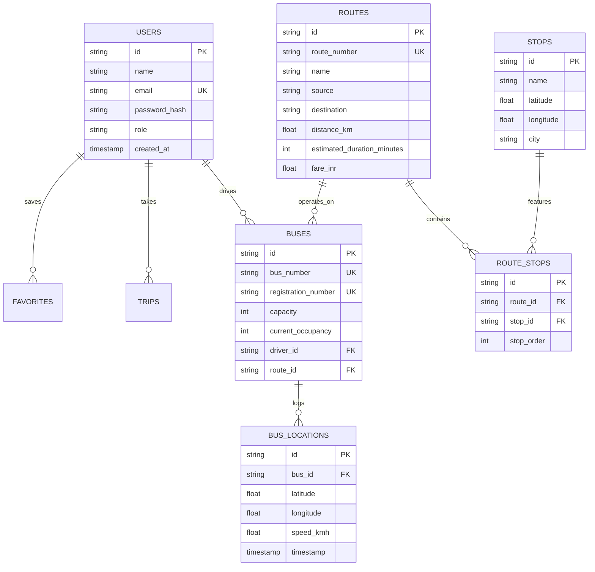

# RideWise - Database Schema & ER Design

## 1. Entity-Relationship (ER) Diagram

---

## 2. Table Specifications

* **`users`**: Manages passenger, driver, and admin user credentials. Indexed on `email`.
* **`buses`**: Manages vehicle fleet specs, driver assignments, and route bindings. Indexed on `bus_number`.
* **`routes`**: Core route configurations. Indexed on `route_number`.
* **`stops`**: Bus stop locations with spatial latitude and longitude coordinates. Indexed on `name` and `city`.
* **`bus_locations`**: Historical and active GPS telematics coordinates. Indexed on `timestamp`.
