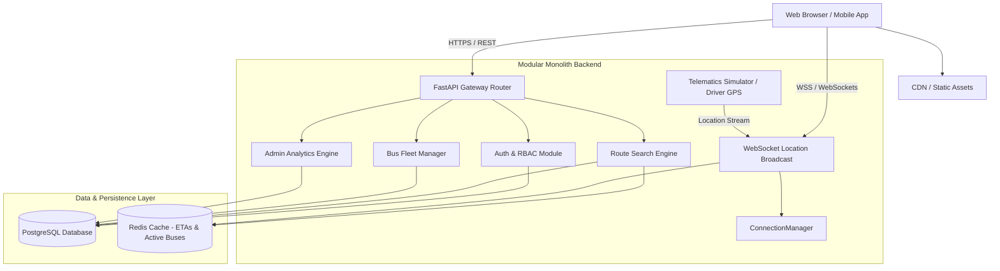
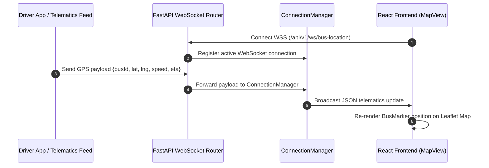

# RideWise - System Design & Architecture Blueprint

## 1. High-Level Architecture Diagram

---

## 2. Real-Time Telematics & WebSocket Flow

---

## 3. Caching & Performance Strategy

1. **Read Heavy Query Caching (Redis):** Nearby bus stops, frequent routes, and active bus locations are stored in Redis with a TTL of 10 to 60 seconds to prevent unnecessary database hits during peak commute hours.
2. **Database Indexing:** Indexed columns on `users.email`, `routes.route_number`, `stops.name`, `stops.city`, `buses.bus_number`, and `bus_locations.timestamp`.
3. **Stateless JWT Authorization:** Tokens are verified statelessly in memory via secret key decoding without hitting the database on every request.

---

## 4. Scalability & Microservices Evolution Path

While the initial implementation uses a **Modular Monolith** pattern for velocity and zero deployment overhead, individual services are strictly isolated into submodules:

* **Location Service:** Can be extracted into a dedicated Go/Rust service for handling 100k+ concurrent WebSocket connections.
* **Route Engine:** Can be decoupled to run routing algorithms (Dijkstra / A*) independently.
* **Notification Service:** Can ingest message events from Redis Streams or Apache Kafka to dispatch push notifications.
